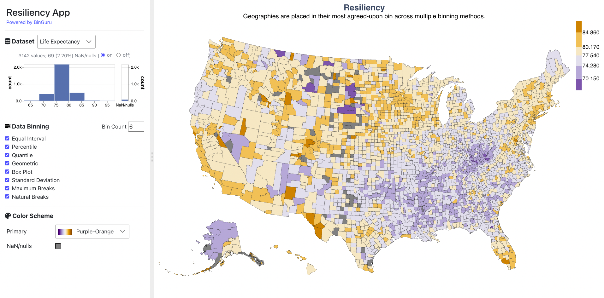

# Resiliency App

Data binning, or data classification, involves grouping quantitative data points into bins (or classes) to represent spatial patterns and show variation in choropleth maps. There are many methods for binning data (e.g., natural breaks, quantile) that may make the same data appear very different on a map. Some of these methods may be more or less appropriate for certain types of data distributions and map purposes. Thus, when designing a map, novice users may be overwhelmed by the number of choices for binning methods and experts may find comparing results from different binning methods challenging. We present resiliency, a new data binning method that assigns areal units to their most agreed-upon, consensus bin as it persists across multiple chosen binning methods. We show how this "smart average" can effectively communicate spatial patterns that are agreed-upon across binning methods. We also measure the variety of bins a single areal unit can be placed in under different binning methods showing fuzziness and uncertainty on a map.



## Setup
0. Open the command line/terminal on your machine and navigate to this project's top-level directory (i.e. where this file is).
1. Download and install node, npm from https://nodejs.org/en/download/. We developed and tested the app on {Node, NPM}: {v20.16.0, 10.9.2}. Optionally, use the <a href="https://github.com/nvm-sh/nvm" target="_blank">nvm (Node Version Manager)</a> to quickly install and use different versions of node via the command line.
2. `npm install -g @angular/cli@19` to install the desired angular-cli used to run ng-* commands.
3. `npm install` - installs required libraries from package.json. 


## Run
4. `ng serve` - compile and serve the application locally
5. Open the browser at http://localhost:4200
6. Enjoy!


## Build and Deployment
7. GitHub Actions

## Credits
Resiliency was created by
<a target="_blank" href="https://narechania.com">Arpit Narechania</a>, <a href="https://va.gatech.edu/endert/">Alex Endert</a>, and <a href="https://friendlycities.gatech.edu/">Clio Andris</a> of the <a target="_blank" href="https://vis.gatech.edu/">Georgia Tech Visualization Lab.</a> We thank the members of the <a target="_blank" href="https://vis.gatech.edu/">Georgia Tech Visualization Lab</a> for their support and constructive feedback.</p>


## Citations
```bibTeX
@InProceedings{narechania2023resiliency,
  author =	{Narechania, Arpit and Endert, Alex and Andris, Clio},
  title =	{{Resiliency: A Consensus Data Binning Method}},
  booktitle =	{12th International Conference on Geographic Information Science (GIScience 2023)},
  pages =	{55:1--55:7},
  series =	{Leibniz International Proceedings in Informatics (LIPIcs)},
  year =	{2023},
  volume =	{277},
  publisher =	{Schloss Dagstuhl -- Leibniz-Zentrum f{\"u}r Informatik},
  doi =		{10.4230/LIPIcs.GIScience.2023.55}
}
```

## License
The software is available under the [MIT License](https://github.com/exploropleth/resiliency-app/blob/master/LICENSE).


## Contact
If you have any questions, feel free to [open an issue](https://github.com/exploropleth/resiliency-app/issues/new/choose) or contact [Arpit Narechania](https://narechania.com).